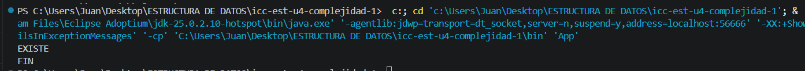

# Práctica: 04.01 Complejidad Proyecto JAVA

## Datos del Estudiante
- **Nombre:** Jose Andres Astudillo Pacheco
- **Curso:** Estructura de Datos G2
- **Fecha:** 14/04/2026
---

## 1. icc-est-u4-complejidad

**Fecha:** 14/04/2026

**Descripción:** Creamos un projecto y lo subimos a un repositorio en GitHub

## 2. icc-est-u4-complejidad

**Fecha:** 15/04/2026

**Descripción:** Creamos una clase Estudiante y Generador, ademas de un listado de estudiantes con datos aleatorios para
buscar y optimizar la busqueda

git add .
git commit -m "Add estudiantes list"
git push

